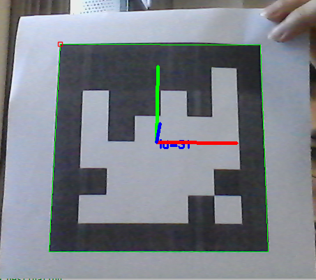

### 彩图转灰度图

```
roslaunch usb_cam usb_cam-test.launch
rosrun chapter_5_opencv image_to_grey
```
### 彩图转灰二值图

```
roslaunch usb_cam usb_cam-test.launch
rosrun chapter_5_opencv image_to_binary
```
### 检测人脸位置

```
roslaunch usb_cam usb_cam-test.launch
rosrun chapter_5_opencv image_face_detect
```
这里要记得改[image_face_detect.cpp](src/image_face_detect.cpp) 中face_cascade_name的路径

### 图片旋转

```
roslaunch usb_cam usb_cam-test.launch
rosrun chapter_5_opencv image_rotation
```

### 二维码识别和定位

- 使用此方法需要提前对自己的摄像头进行标定，得到如 [ost.yaml](config/ost.yaml)所示的相机标定文件,标定方法可以参考教案 或者 [camera_calibration](http://wiki.ros.org/camera_calibration)

- 运行`rosrun chapter_5_opencv image_QR_create `
得到以下图案，并将其打印出来


- 运行以下命令：

```
roslaunch usb_cam usb_cam-test.launch
rosrun chapter_5_opencv image_QR_detect
```

将打印的得到的图案放在相机前面即可得到下图识别效果



- 输入命令：
`rostopic echo /aruco/pose`
即可得到位姿信息

### 备注
用到了功能包：usb-cam,请提前下载相应版本
`sudo apt install ros-melodic-usb-cam`

### 参考资料
[OpenCV官网](https://docs.opencv.org/4.x/d9/df8/tutorial_root.html)